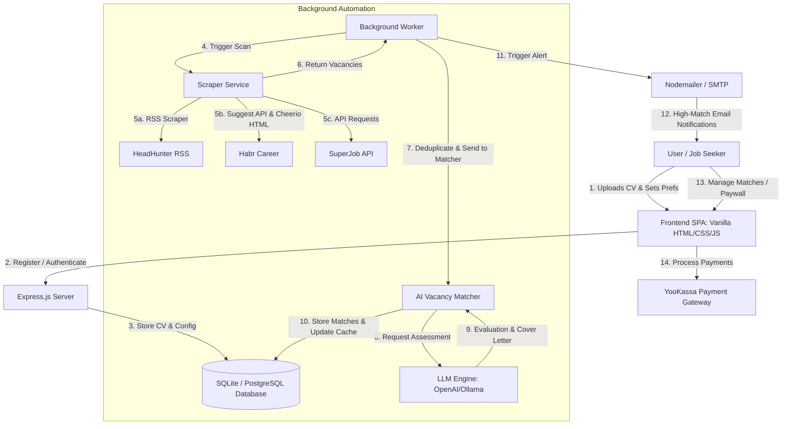

# HH4YOU — AI-Powered Vacancy Matcher & Cover Letter Generator 🎯

[](https://playwright.dev/)
[](https://nodejs.org/)
[](https://www.postgresql.org/)
[](https://openai.com/)

**HH4YOU** is a full-stack, automated job-seeking assistant designed to eliminate the manual grind of searching for roles, matching resume skills with vacancy requirements, and writing personalized cover letters. 

The application periodically scans popular Russian job boards (**HeadHunter**, **Habr Career**, and **SuperJob**), runs the parsed vacancies through an **LLM** (e.g., GPT-4o-mini or a local Ollama instance) to compare them against the user's CV, evaluates match scores (0-100%), writes customized cover letters, and sends instant email alerts for high-suitability matches.

> [!NOTE]
> **QA Engineering Portfolio Showcase:** This repository has been engineered to serve as a high-quality demonstration of QA Automation, E2E testing architecture, and robust software design. It features a complete test automation suite covering both API and UI layers using Playwright, TypeScript, and database-level seeder fixtures.

---

## 🗺️ System Architecture & Data Flow



---

## 🧪 QA & Test Automation Infrastructure (Portfolio Highlight)

The project includes a robust, production-grade test automation suite written in **TypeScript** using **Playwright**. The tests are structured to demonstrate industry-standard QA practices, separation of concerns, and clean automation patterns.

### 📁 Test Directory Structure
```
e2e/
├── api-clients/     # Programmatic wrappers for API-level assertions & rapid test setup
├── data/            # Dynamic test data generators and CV templates (Factories)
├── fixtures/        # Playwright test overrides and database seeding controllers
├── pages/           # Page Object Model (POM) representations of the UI screens
└── tests/
    ├── api/         # Core API endpoint integration tests
    └── ui/          # End-to-end user flow & Visual Regression tests
```

### 🛠️ Key Testing Practices & Design Patterns

1. **Page Object Model (POM) Pattern:**
   All UI selectors and user interactions are decoupled from the test specifications. UI tests reference semantic locators defined under `e2e/pages/` (e.g., [auth-modal.page.ts](file:///d:/Projects/HH4ME/e2e/pages/auth-modal.page.ts) or [dashboard.page.ts](file:///d:/Projects/HH4ME/e2e/pages/dashboard.page.ts)) to maximize maintainability.
   
2. **Direct Database Seeding (`db-seeder.ts`):**
   To bypass complex or slow user registration and payment flows during testing, the [DbSeeder](file:///d:/Projects/HH4ME/e2e/fixtures/db-seeder.ts) establishes direct SQLite connections. This allows:
   - Programmatic account creation.
   - Injecting active subscriptions directly into the database (bypassing the YooKassa payment overlay).
   - Fast state resets (`clearTestUsers`) inside `beforeEach`/`afterEach` hooks to guarantee test isolation.

3. **Layered API Testing & API Clients:**
   Instead of relying on raw URL fetch requests, API tests utilize structured HTTP clients (e.g., [auth.client.ts](file:///d:/Projects/HH4ME/e2e/api-clients/auth.client.ts)). These clients serve a dual purpose: testing REST endpoints directly and enabling rapid authentication/setup for UI tests without going through the graphical login screens.

4. **Visual Regression (Snapshot Testing):**
   Uses Playwright's visual comparison tools (`visual-regression.spec.ts`) to capture and verify layout rendering under multiple viewports, preventing layout shifts or visual regressions in responsive views.

5. **Test Parallelization & Database Optimization:**
   The SQLite connection in test mode is configured with **Write-Ahead Logging (WAL)** mode and strict busy timeout thresholds to enable parallelized Playwright workers without database locking issues (`database is locked`).

---

## 🚀 Technical Tech Stack

### Backend
* **Runtime:** Node.js (v20+)
* **Framework:** Express.js
* **Database:** SQLite (development, local integration tests) & PostgreSQL (production)
* **AI Engine:** OpenAI-compatible API wrapper (`gpt-4o-mini` by default; easily swappable with local models via Ollama, OpenRouter, or Sber GigaChat)
* **Auth & Security:** JWT (JSON Web Tokens), `cookie-parser`, `bcryptjs` password hashing, and endpoint rate-limiting using `express-rate-limit`
* **Scraping Engine:** Cheerio (HTML parsing), Axios (HTTP requests with retry mechanisms & concurrency throttling)
* **Notifications:** SMTP-based email notifications via Nodemailer
* **Payments:** YooKassa API Integration for monthly subscriptions

### Frontend
* **UI Structure:** Single Page Application (SPA) in Vanilla HTML5 / JavaScript (ES6)
* **Styling:** Custom Vanilla CSS (with modern dark mode theme, glassmorphism UI elements, transitions, and fully responsive layouts)
* **Assets:** Boxicons icons pack, Google Fonts (Inter, Manrope)

---

## ⚙️ Configuration & Environment

The application configuration is managed via environment variables. Copy the template and fill in your keys:

```bash
cp .env.example .env
```

Key environment properties:
* `DATABASE_URL`: Connection string for Postgres (production).
* `DB_TYPE`: Set to `sqlite` for lightweight local development and automated E2E testing.
* `LLM_BASE_URL` & `LLM_API_KEY`: API configurations for GPT-4o-mini, OpenRouter, Sber GigaChat (`https://api.giga.chat/v1`), or a local Ollama instance (`http://localhost:11434/v1`).
* `SMTP_HOST`, `SMTP_PORT`, `SMTP_USER`, `SMTP_PASSWORD`: Outgoing email parameters for real-time notifications.
* `YOOKASSA_SHOP_ID` & `YOOKASSA_SECRET_KEY`: YooKassa credentials for testing/live payments.

---

## 🏁 Getting Started

### Prerequisites
* Node.js v20 or higher
* npm v10 or higher
* (Optional) Docker

### 1. Installation
Clone the repository and install the development and production dependencies:
```bash
npm install
```

### 2. Run the Application locally
Start the Express server and the background scheduler worker:
```bash
npm start
```
By default, the server runs on [http://localhost:8000](http://localhost:8000).

---

## 🧪 Running the Test Suite

All tests run against a localized SQLite database configured automatically by Playwright's local server configuration.

| Command | Description |
| :--- | :--- |
| **`npm run test:e2e`** | Runs the entire E2E suite (both API & UI tests) |
| **`npm run test:ui`** | Runs only the graphical UI tests (Desktop and Mobile viewports) |
| **`npm run test:api`** | Runs only the backend integration API tests |
| **`npm run test:report`** | Opens the HTML reporter to review test results, trace logs, and videos |

### Test Run Features
* **Retries:** Configured to run retries automatically in CI modes.
* **Artifacts:** Capture screenshots, network traces, and session recordings automatically on test failures.
* **Parallel Execution:** Leverages multi-core processing to run non-dependent tests concurrently.

---

## 🐳 Docker Deployment

To build and run the application in a lightweight containerized environment:

```bash
# Build the Docker image
docker build -t hh4you .

# Run the container (Map port 8000 and mount your local database/env files)
docker run -p 8000:8000 --env-file .env hh4you
```
